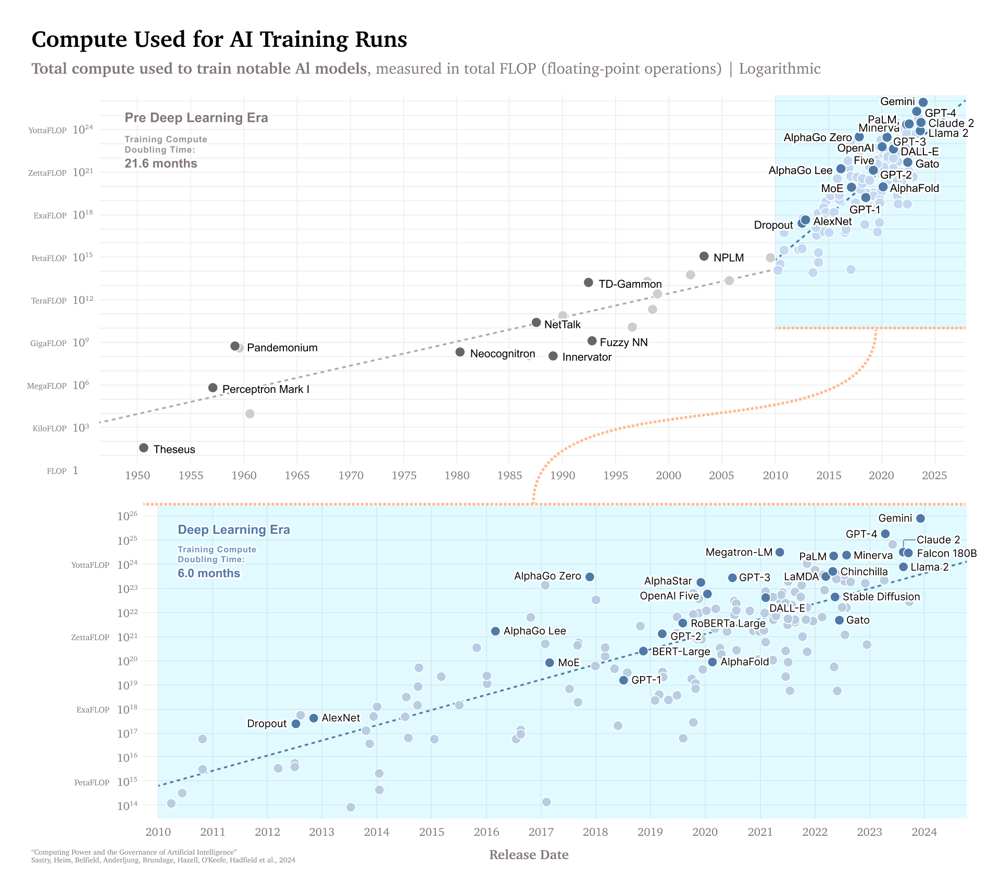

# Figures of "Computing Power and the Governance of AI"

Repository for the figures of the paper "*Computing Power and the Governance of AI*".

- You can read the paper [here](https://bit.ly/CPGAI).
	- [Summary on the GovAI blog](https://bit.ly/CPGAI-blog)
	- [Summary on the Leverhulme Centre for the Future of Intelligence blog](http://lcfi.ac.uk/news-and-events/news/2024/feb/14/compute-ai-governance)

Please cite as:
```
@report{sastryComputingPowerGovernance2024,
  title = {Computing {{Power}} and the {{Governance}} of {{Artificial Intelligence}}},
  author = {Sastry, Girish and Heim, Lennart and Belfield, Haydn and Anderljung, Markus and Brundage, Miles and Hazell, Julian and O’Keefe, Cullen and Hadfield, Gillian K and Ngo, Richard and Pilz, Konstantin and Gor, George and Bluemke, Emma and Shoker, Sarah and Egan, Janet and Trager, Robert F and Avin, Shahar and Weller, Adrian and Bengio, Yoshua and Coyle, Diane},
  date = {2024-02-14},
  url = {https://bit.ly/CPGAI},
  abstract = {Computing power, or "compute," is crucial for the development and deployment of artificial intelligence (AI) capabilities. As a result, governments and companies have started to leverage compute as a means to govern AI. For example, governments are investing in domestic compute capacity, controlling the flow of compute to competing countries, and subsidizing compute access to certain sectors. However, these efforts only scratch the surface of how compute can be used to govern AI development and deployment. Relative to other key inputs to AI (data and algorithms), AI-relevant compute is a particularly effective point of intervention: it is detectable, excludable, and quantifiable, and is produced via an extremely concentrated supply chain. These characteristics, alongside the singular importance of compute for cutting-edge AI models, suggest that governing compute can contribute to achieving common policy objectives, such as ensuring the safety and beneficial use of AI. More precisely, policymakers could use compute to facilitate regulatory visibility of AI, allocate resources to promote beneficial outcomes, and enforce restrictions against irresponsible or malicious AI development and usage. However, while compute-based policies and technologies have the potential to assist in these areas, there is significant variation in their readiness for implementation. Some ideas are currently being piloted, while others are hindered by the need for fundamental research. Furthermore, naïve or poorly scoped approaches to compute governance carry significant risks in areas like privacy, economic impacts, and centralization of power. We end by suggesting guardrails to minimize these risks from compute governance.}
}
```




